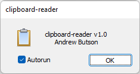

# clipboard-reader

A simple app that i wrote many years ago. This app has helped me proof read as a background task. Still functioning as expected, and I use it daily. The tool is a wrapper around text-2-speech. This is now a simple hook, but back in 2003, win32 was the only way to use new windows features and avoided using .net and all the +framework bloat.

Would I want to go back to ATL/WTL? No. But I do miss fast compile-time and native compilation, no GC, no framework bloat, ... I've revamped to use some of the newer 21 standards—just a fun project with pratical use, for me at least.

## Usage
Compiles with any win SDK, either msvc or clang.

When the app run an icon is show in the taskbar.

This app hooks into win32 hotkeys. Copying text into the clipboard and simply hitting Ctrl key three (3) times in quick succession. Then sit back and listen to your clipboard.

